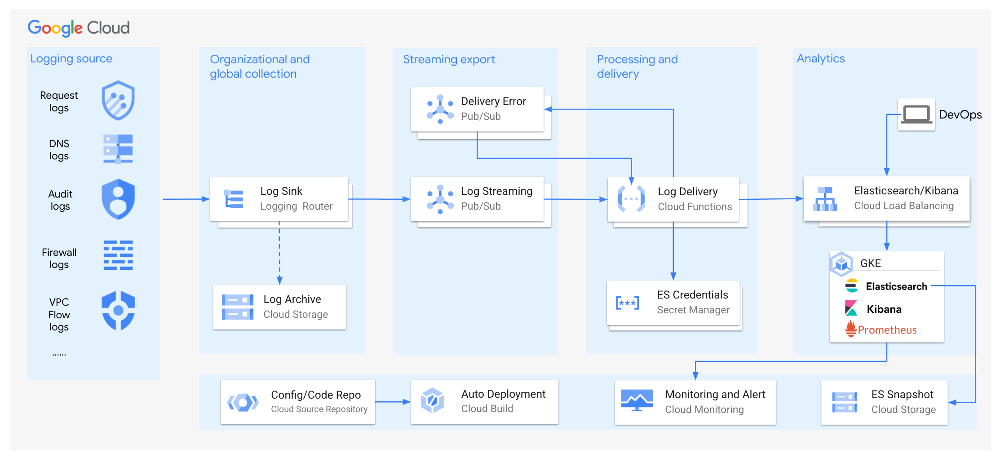
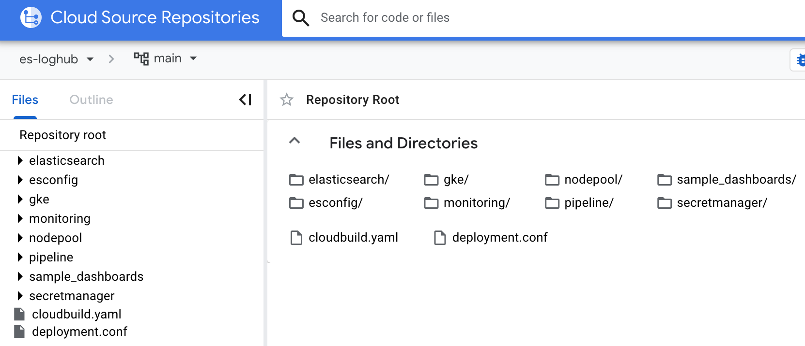
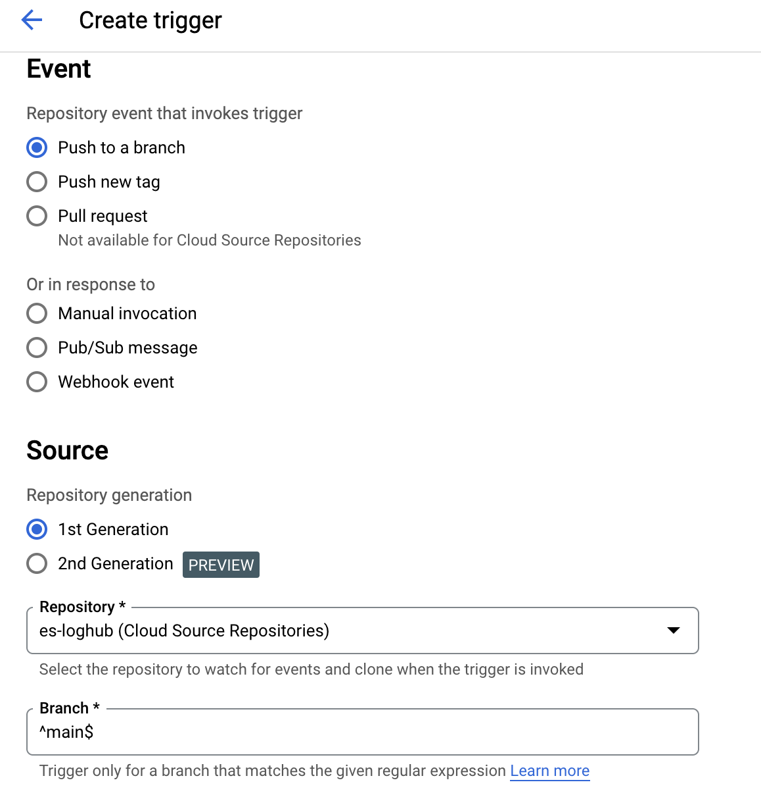
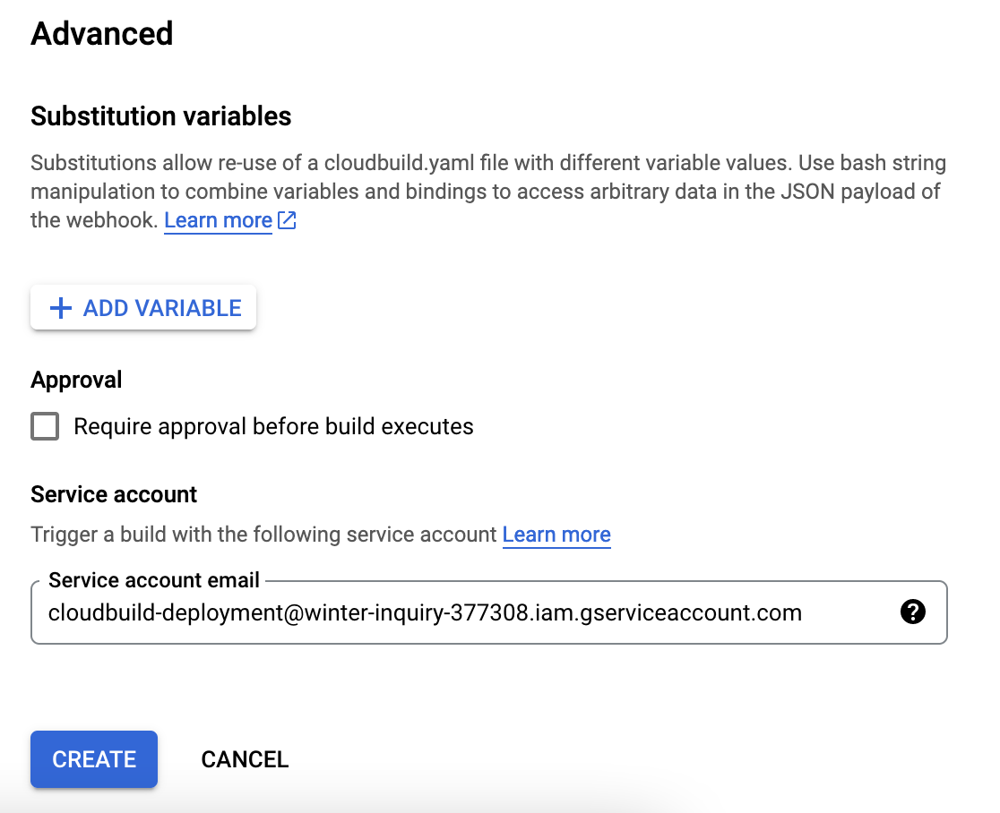

# Deploy Elasticsearch based loghub on GCP

**You can follow this guide to quickly and automatically deploy a production-ready Log Hub on GCP, including:** 
 1. Elasticsearch cluster on GKE
 2. Log sinks, to collect Audit logs, Cloud Load Balancing logs, DNS query logs...
 3. Log pipelines, to process and deliver logs into Elasticsearch
 4. All components and configurations are centrally managed by Terraform, with auto deployment by Cloud Build GitOps



## 1. Clone git repo

```
git clone https://github.com/hxhwing/es-loghub.git
cd es-loghub
```

## 2. Upload repo to your own Git or Cloud Source Repository



## 3. Create a new service account for deployment

> **Note**
>
> Here "Editor" role is granted to this service account for easy deployment. You should use a fine-grained role in your production environment

```
gcloud iam service-accounts create cloudbuild-deployment \
    --display-name="cloudbuild-deployment"

gcloud projects add-iam-policy-binding PROJECT_ID \
    --member="serviceAccount:cloudbuild-deployment@PROJECT_ID.iam.gserviceaccount.com" \
    --role="roles/editor"

gcloud projects add-iam-policy-binding winter-inquiry-377308 \
    --member="serviceAccount:cloudbuild-deployment@winter-inquiry-377308.iam.gserviceaccount.com" \
    --role="roles/editor"

```

## 4. Create Cloud Build trigger
Create one Cloud Build trigger
 1. Use your new created Github or Cloud Source Repository in step2 as trigger.
 2. Choose Service Account created in step3, by default Cloud Build will use default Compute Engine Service Account.
 3. Leave all other configuration default




## 5. Modify configuration to trigger deployment

### 5.1 Prepare deloyment configuration
All components configuration could be managed by ```deployment.conf``` file.

You can control:
 1. Whether to create a new GKE cluster
 2. Whether to create a new node pool for Elasticsearch on existing GKE cluster
 3. Elasticsearch Cluster configuration details, including ES version, count of nodes, storage size...
 4. What logs need to be collected, index template settings for each kind of log, like index prefix, count of replica...

```
# Choose resource location
region="us-central1"
project_id=

# Specify GCS bucket for terraform backend state
bucket_name="hxh-demo"

# ========= GKE configuration ========= #

# Create a new GKE cluster? (enable Managed Prometheus, Workload Identity)
create_new_cluster=false

# GKE cluster name (required)
cluster_name="escluster"

# ========= GKE node pool configuration ========= #

# Create a new node pool for Elasticsearch?
create_new_nodepool=false

# Instance type for elasticsearch nodes
instance_type="n2-standard-4"

# Initial node count per zone of elasticsearch node pool
node_count=1

# ========= Elasticsearch configuration ========= #
# Deploy Elasticsearch into GKE?
deploy_elasticsearch=false

# namespace for Elasticsearch components 
namespace=es

elasticsearch_version=8.6.2
kibana_version=8.6.2

# Master nodes (nodeSelector: app: elasticsearch)
master_node_count=3

# Hot data nodes
hot_node_count=3

# Storage size per hot data node(GiB)
hot_storage_size=300
hot_storage_class=pd-balanced

# Warm data nodes
warm_node_count=3

# Storage size per warm data node(GiB)
warm_storage_size=300
warm_storage_class=pd-balanced


# ========= Log pipeline configuration ========= #
## Require organization-level logging permission on Cloud Build SA(project_id@@cloudbuild.gserviceaccount.com)

organization_id=646647585290

# Enable auditLog pipeline to elasticsearch (index: log-audit-yyyymmdd)
auditlog=false
auditlog_index_prefix=log-audit
auditlog_replica=1
#auditlog_retention=30

# Enable dnslog pipeline to elasticsearch (index: log-dns-yyyymmdd)
dnslog=false
dnslog_index_prefix=log-dns
dnslog_replica=1
#dnslog_retention=30

# Enable load balancing http log pipeline to elasticsearch (index: log-http-yyyymmdd)
httplog=false
httplog_index_prefix=log-http
httplog_replica=1
#httplog_retention=30

# firewall logs, VPC Flow logs ……
```

### 5.2 Trigger deployment
After deployment configuration ready, you can push changes to repository, to trigger deployment automatically.

**Make sure specify these variables to "true" for a new all-in-one deployment**
```
create_new_cluster=true
create_new_nodepool=true
auditlog=true
dnslog=true
httplog=true
```

### 5.3 Check deployment

For GKE cluster, if "true":
 - One new GKE cluster will be created, with proper configuration

For GKE node pool, if "true":
- One new node pool will be created, with node label "app:elasticsearch"

For Elasticsearch:
 - Elasticsearch cluster
    - External LB service type for API access
    - Workload Identity enabled for GCS snapshot
    - One API key for data ingestion, saved in Secret Manager
    - One user for administration, saved in Secret Manager
    - One user for monitoring
    - Index templates for logs
 - Kibana
    - External LB service type for web access
 - Prometheus
    - Prometheus exporter to monitor ES status
    - PodMonitoring to export ES metrics to Cloud Monitoring

For log pipelines:
 - Log router for each log type with inclusion and exclusion filter to export logs to Pub/Sub topic
 - Pub/Sub topics for each log type, push logs to Cloud Functions 2nd
 - Cloud Functions 2nd (Cloud Run), process/enrich logs, and deliver to Elasticsearch by API

## 6. Update deployment

If you want to update some settings, like:
 1. Increase ES node counts
 2. Upgrade ES version
 3. Add new log types
 4. Update index template settings
 5. ......

You can just modify the "deployment.conf", push to repository, then Cloud Build will modify Terraform manifests automatically and deploy changes.